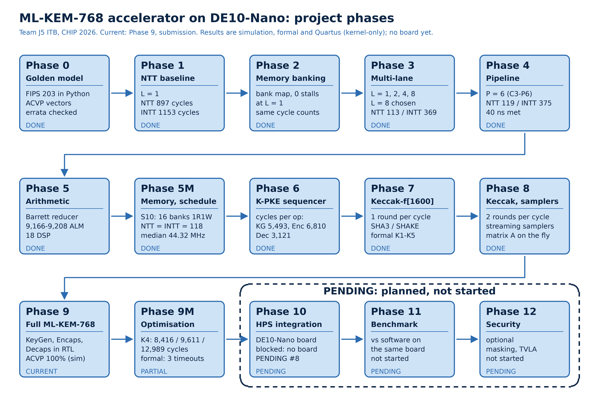

# ML-KEM-768 accelerator on DE10-Nano

Tim J5, Institut Teknologi Bandung. CHIP 2026 Hackathon (PERURI Digital Summit), kategori *IC Chip Design & FPGA Implementation*.

Repositori ini berisi RTL, model acuan, bukti verifikasi dan hasil Quartus untuk akselerator ML-KEM-768 (NIST FIPS 203).
Rancangan membagi tugas: Keccak-f[1600], NTT/INTT dan aritmetika polinomial di FPGA; alur protokol dan baseline
perangkat lunak di HPS. Matematika FIPS 203 tidak diubah. Yang dirancang adalah arsitekturnya.

## Kategori lomba

Proyek ini ikut kategori *IC Chip Design & FPGA Implementation* di CHIP 2026 Hackathon. Kategori ini punya empat subtema,
masing-masing dengan baseline acuan:

| No | Subtema | Fokus | Baseline acuan |
|---|---|---|---|
| 01 | Secure Identity & Security Element Chip | fungsi secure element atau identitas: autentikasi, integritas, penanganan kunci, anti-tamper | Peruri chip, TT07 SHA-256, ECC, PUF |
| 02 | Hardware Cryptography Accelerator | blok kriptografi kecil dan hemat area yang dapat diintegrasikan ke baseline | TT07 SHA-256, desain kripto lain |
| 03 | AI / Edge Accelerator | akselerator untuk MAC, jaringan saraf kecil, beban vektor/komputasi, atau inferensi edge | TT07 Iterative MAC, TinyTPU, referensi Mini AIE |
| 04 | Secure Communication | komunikasi serial/paralel, CDC, keamanan protokol, secure framing, integritas antarmuka | TT07 SerDes, CDC FIFO |

Subtema yang dipilih: 02, Hardware Cryptography Accelerator. Proyek ini adalah blok kriptografi pasca-kuantum (ML-KEM-768 dengan Keccak dan NTT)
yang dirancang hemat area dan dapat diintegrasikan ke sistem lain. Baseline TT07 SHA-256 memakai SHA-256, sedangkan ML-KEM memakai SHA-3/Keccak.

## Tim J5, Institut Teknologi Bandung

| Peran | Nama |
|---|---|
| Ketua | Muhamad Faza Dzil Ikram |
| Anggota | Christian Jonathan Hutajulu |
| Anggota | Jevan Abielle |
| Anggota | Jose Luis Fernando Saragi |

## Target

| Item | Nilai |
|---|---|
| Board | Terasic DE10-Nano. Belum ada papan; semua hasil berasal dari simulasi, analisis formal dan Quartus |
| Device | Intel Cyclone V SE 5CSEBA6U23I7 (41.910 ALM menurut fitter, 553 blok RAM, 112 DSP) |
| EDA | Quartus Prime Lite 25.1std (angka implementasi hanya dari sini) |
| Verifikasi terbuka | Verilator, Icarus, Yosys + slang, SymbiYosys, cocotb |
| Bahasa | SystemVerilog |

## Parameter ML-KEM yang dipakai

`q = 3329`, `n = 256`, `k = 3`, `η1 = η2 = 2`, `du = 10`, `dv = 4`, akar satuan `ζ = 17`.
Ukuran: ek 1184 B, dk 2400 B, ciphertext 1088 B, shared key 32 B.
NTT-nya *incomplete* (7 layer, perkalian titik berupa base-case multiply derajat 1). Konstanta dikunci di
[tb/golden/params.py](tb/golden/params.py).
Pemeriksaan masukan FIPS 203 dikerjakan HPS, bukan RTL (ADR 0031).

## Status: Phase 9 — Submission

Inti ML-KEM-768 penuh (KeyGen, Encaps, Decaps) sudah ada di RTL dan lolos semua vektor ACVP yang berlaku di dua
simulator. Phase 9M mengoptimasi inti itu; hasil terakhirnya (K4, `mlkem_core4`) diterima tim pada 2026-10-05
(ADR 0035, 0037, 0038, 0040 sampai 0043). ADR 0033 (inti Phase 9 apa adanya) masih menunggu keputusan (PENDING #33).

Angka K4 (kernel-only, virtual pin, bukan pengukuran papan; sumber
[docs/results/phase9m.md](docs/results/phase9m.md)):

| | KeyGen | Encaps | Decaps |
|---|---|---|---|
| Siklus (simulasi) | 8.416 | 9.611 | 12.989 |
| Latensi pada Fmax median 76,665 MHz (perhitungan tim) | 109,8 µs | 125,4 µs | 169,4 µs |

K4 memakai 14.222,0 ALM median pada batasan 40 ns. Batasan 15 ns terpenuhi di 6 dari 6 seed.

| Phase | Isi | Status (file hasil) |
|---|---|---|
| 0 | Model acuan Python, vektor ACVP, errata | DONE |
| 1 – 3 | NTT L = 1, banking memori, multi-lane (L = 8) | DONE |
| 4 – 5 | Pipeline P = 6, reducer Barrett | DONE |
| 5M, 6 | Memori S10 (16 bank 1R1W), sequencer K-PKE | DONE |
| 7 – 8 | Keccak-f[1600], sponge, sampler streaming | DONE (penerimaan ADR oleh tim) |
| 9 | Inti ML-KEM-768 penuh, simulasi | DONE (penerimaan ADR 0033 oleh tim) |
| 9M | Optimasi inti | PARTIAL: tiga bukti formal berbatas habis waktu |
| 10 | Integrasi HPS di DE10-Nano | Direncanakan; terblokir tanpa papan (PENDING #8) |
| 11 | Benchmark terhadap perangkat lunak | Direncanakan |
| 12 | Fitur keamanan lanjutan (opsional) | Direncanakan |

Phase 10 sampai 12 tercatat di ROADMAP dan belum dikerjakan.

## Verifikasi

Verifikasi dilakukan dalam beberapa lapis:

1. Model acuan Python (`tb/golden/`) terhadap vektor ACVP resmi dan pustaka independen.
2. RTL terhadap model acuan, bit-exact, di Verilator dan Icarus (cocotb).
3. Uji aritmetika menyeluruh: reducer dan butterfly diuji pada semua pasangan masukan dalam [0, q).
4. Bukti siklus konstan: jumlah siklus sama untuk masukan rahasia berbeda.
5. Analisis formal (SymbiYosys) untuk properti kendali dan alamat, dengan kontrol negatif.
6. Quartus kernel-only: ALM, register, RAM, DSP, Fmax, slack, enam seed.

Struktur test: [tb/](tb/README.md). Properti formal dan batasnya: [formal/](formal/README.md).

## Peta repositori

| Folder | Isi |
|---|---|
| [rtl/](rtl/README.md) | SystemVerilog: `arith`, `ntt`, `mem`, `keccak`, `sample`, `sched`, `mlkem` |
| [tb/](tb/README.md) | testbench cocotb dan model acuan Python |
| [formal/](formal/README.md) | properti SymbiYosys per fase, dan `run/` untuk menjalankannya |
| [quartus/](quartus/README.md) | proyek dan revisi Quartus |
| [scripts/](scripts/README.md) | generator ROM, pemilih hasil, uji, arsip Quartus |
| [docs/](docs/README.md) | roadmap, keputusan, hasil per fase, laporan PDF |
| [evidence/](evidence/README.md) | bukti terukur per fase |
| [sw/hps/](sw/hps/README.md) | sisi HPS (belum ada kode) |

## Keterbatasan saat ini

- Tidak ada hasil papan. Tidak ada klaim validasi perangkat keras.
- Angka Quartus berasal dari kompilasi kernel-only dengan virtual pin, bukan sistem lengkap dengan HPS.
- Tidak ada perbandingan dengan perangkat lunak di HPS (Phase 11).
- Siklus konstan dibuktikan pada masukan yang diuji. Ini bukan klaim ketahanan side-channel (daya/EM).
- Formal berbatas: P1 dan NC-E1-4 di `core4` serta NC-B7 di `core3` habis waktu dan dicatat sebagai TIMEOUT, bukan lolos.

## Dokumentasi

- [Keputusan desain aktif](docs/decisions/decision_summary.md), ringkasan semua ADR: [SUMMARY.md](docs/decisions/SUMMARY.md)
- [Evidence per fase](docs/evidence/README.md)
- [Laporan PDF](docs/reports/README.md), laporan lengkap: [CHIPATON_COMPLETE_REPORT.pdf](docs/reports/CHIPATON_COMPLETE_REPORT.pdf)
- [Quartus Outputs](https://drive.google.com/drive/folders/10K6DFZt6R8QQfE4S6NYVbSmj5wOPOBIW?usp=sharing)

### Quartus Outputs

Output Quartus yang besar (`output_files/`, `db/`, laporan penuh) tidak disimpan seluruhnya di repository.
Hasilnya tersedia melalui Google Drive: [Quartus Outputs](https://drive.google.com/drive/folders/10K6DFZt6R8QQfE4S6NYVbSmj5wOPOBIW?usp=sharing).
Di repository hanya ada ekstrak per revisi di `evidence/`.
